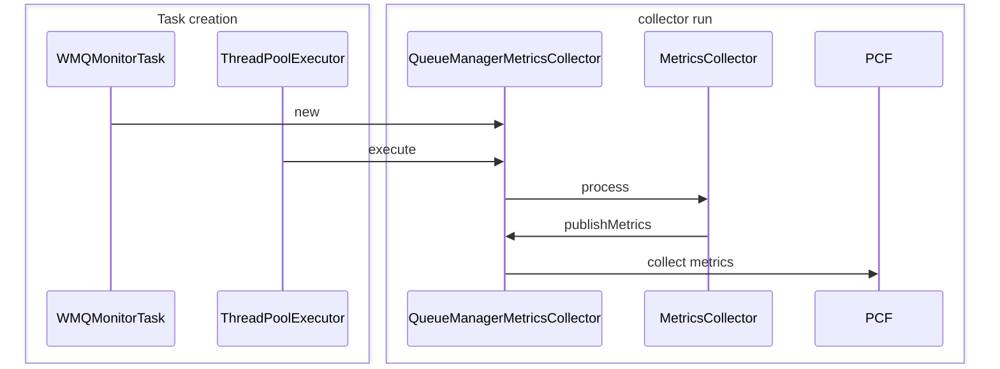

 

MetricWriteHelper  <---work with--- WMQMonitor --create --> WMQMonitorTask

when WMQMonitor is run, it gets a list of getConfigYml().get("queueManagers");
and for each "queueManagers" config and it creates a WMQMonitorTask.
WMQMonitorTask is then scheduled as a task to run.

When WMQMonitorTask is run, it initializes the MQ stuff, such as MQQueueManager, and initializes the PCFMessageAgent. 
Then, the task begins collecting metrics for Queue Manager, Channel, Queue, Listener, Topic 

